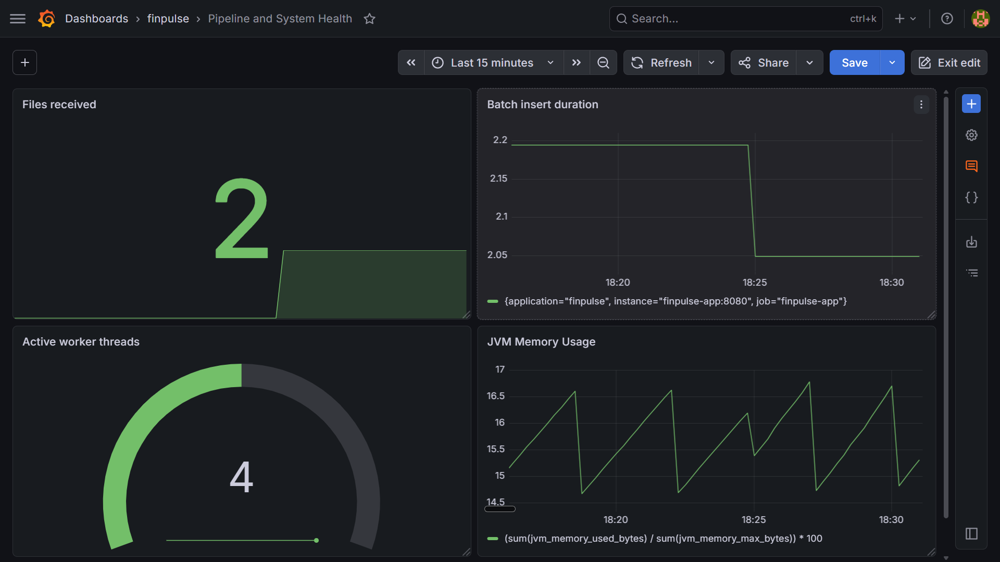
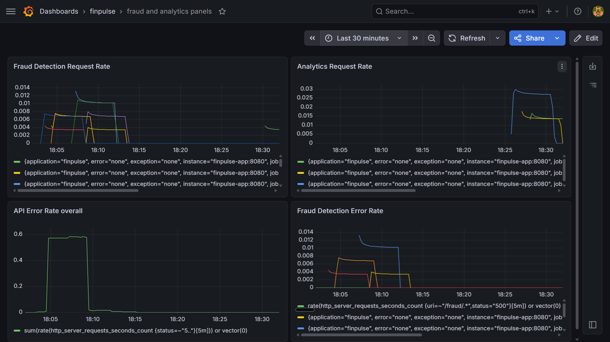
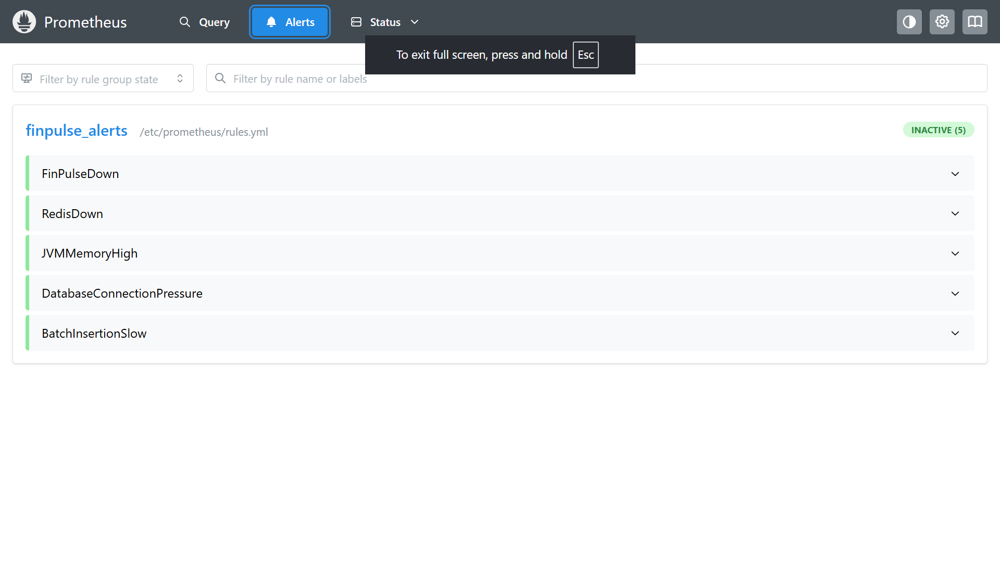
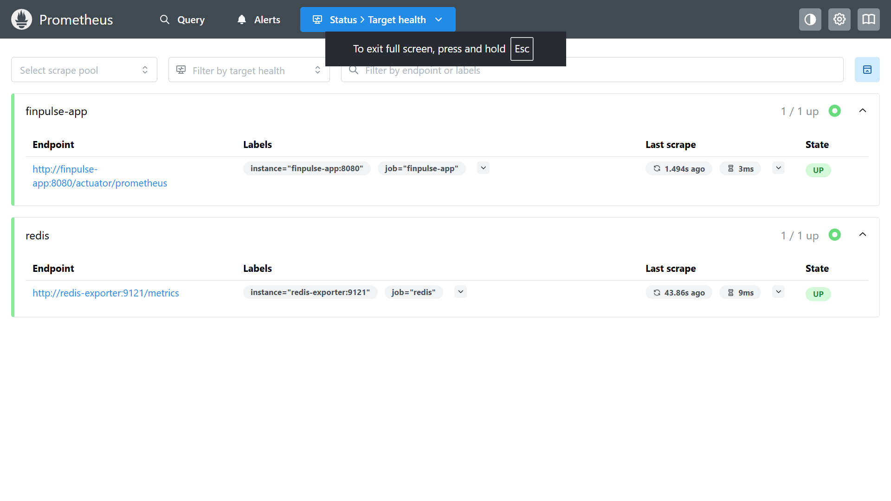

# FinPulse
Financial transaction processor — built around the problems
of bulk ingestion, concurrent writes, and fraud pattern detection.

---

## Architecture

<div align="center">

</div>

---

## What This Project Taught Me

ShopNest taught me how a backend handles requests.
FinPulse taught me what happens when the request
is not the hard part.

I wanted to understand how systems handle data at scale —
not one request at a time, but thousands of rows coming
in together. So I built a batch processor.

**Problems I hit while building:**

**1. schema.sql and JPA were both trying to create the table at startup.**
`ddl-auto` was set alongside `schema.sql` — Spring did not know
which to follow. Set `ddl-auto=never` to stop JPA touching the schema.
But then `schema.sql` ran on every restart and MySQL 8 does not support
`CREATE INDEX IF NOT EXISTS` on indexes — so the second run failed.
Fixed by removing the index creation from `schema.sql` and creating
the table and index manually on first deployment. The schema runs
once and never again.

**2. 16 threads logging at the same time — no way to tell which thread failed.**
Before `fileProcessingId` existed, all worker threads logged to the
same output with no identifier. When an error appeared, there was no
way to know which file it belonged to, which chunk failed, or which
thread threw it. MDC works for HTTP request threads because Spring
manages them — but worker threads here are created manually and MDC
does not carry across. The fix was generating one UUID when the file
arrives, every chunk gets that ID, every thread logs it from whatever
chunk it picks up. One search on that ID shows the entire journey of
that file across all threads.

**3. Valid rows were being rejected because of date format.**
The CSV files had dates in different formats — some rows had
`2024-01-15 10:30:00`, others had `15/01/2024 10:30:00`.
`DateTimeFormatter` only accepts one format — first mismatch
throws and the row gets rejected. No error, no reason, just gone.
Fixed by trying 5 formatters in order — first one that works wins.
If none match, the row is logged as `INVALID_DATE` and skipped.
Valid rows with any date format now pass through.

**4. `jdbcTemplate.batchUpdate()` sends one row at a time by default.**
Looks like it sends 500 rows in one shot — but without
`rewriteBatchedStatements=true` in the JDBC URL, MySQL driver
sends each row as a separate INSERT. 500 rows = 500 round trips
to the database. The batch is just a loop in disguise.
Adding `rewriteBatchedStatements=true` tells the MySQL driver
to combine all 500 INSERTs into one statement before sending.
One network round trip instead of 500. You can see the difference
even on a small file.

---

## Observability

<div align="center">

</div>

---

## Live

| | Link |
|--|------|
| Swagger | http://65.2.214.153:8080/swagger-ui/index.html |
| Prometheus | http://65.2.214.153:9090 |
| Grafana | http://65.2.214.153:3000 |

---

## Screenshots






---

## Tech Stack

| Technology | Purpose |
|------------|---------|
| Java 17 | Core language |
| Spring Boot 3.4.5 | Application framework |
| Spring Data JPA | Database access |
| Spring JDBC | Batch insert operations |
| MySQL 8 | Primary database |
| Redis 7.2 | Fraud and analytics result caching |
| Micrometer + Prometheus | Metrics collection |
| Grafana | Metrics visualization |
| Logstash Encoder | Structured JSON logging |
| Docker + Docker Compose | Containerization |
| Swagger / OpenAPI | API documentation |

---

## Setup

**Prerequisites**
- Docker and Docker Compose

```bash
git clone https://github.com/pavankumar-labs/finpulse-transaction-processor.git
cd finpulse-transaction-processor
cp .env.example .env
# Fill in your values in .env
docker compose up --build -d
```

---

## What I Would Add Next

**1. Rejected rows are only logged right now — INVALID_DATE,
NON_POSITIVE_AMOUNT, INSUFFICIENT_FIELDS — and then discarded.
I want to store them in a separate table instead. An account
that repeatedly sends malformed or invalid amounts is worth
flagging on its own.**

**2. If a batch insert fails halfway, rows already inserted
stay and the rest are lost silently. I want failed batches
to retry up to 3 times before the file is marked as failed.**

**3. The table and index are created manually on first deployment
because schema.sql and ddl-auto conflict. I want a startup check
that creates them only if they do not exist — so a fresh
deployment needs zero manual steps.**
